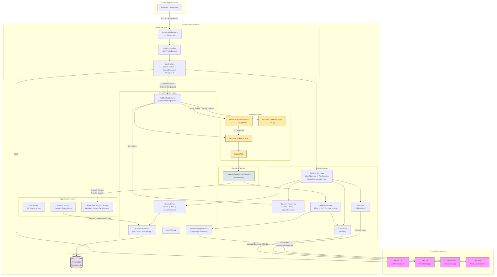

# BazzucaMedia - Social Media Management Platform


## Overview

**BazzucaMedia** is a multi-tenant social media management platform for scheduling and publishing content across multiple social networks (X/Twitter, Instagram, Facebook, LinkedIn, TikTok, YouTube). Built with **.NET 8** and **PostgreSQL**, it provides client management, post scheduling with calendar view, media upload via AWS S3, and automated publishing.

The project follows **Clean Architecture** with six layers and supports per-tenant database isolation. Publishing to **X/Twitter** is synchronous, while **LinkedIn** uses an asynchronous architecture with **RabbitMQ** message queues, retry with TTL, and dead-letter queues (DLQ), processed by a background Worker service using **Playwright** for browser automation.

---

## Features

- 🏢 **Multi-Tenant** - Per-tenant database isolation via `X-Tenant-Id` header and JWT claims
- 👥 **Client Management** - CRUD for client accounts with soft-delete
- 📅 **Post Scheduling** - Calendar-based scheduling with automatic conflict resolution (30-min increments)
- 🌐 **Social Network Integration** - OAuth credential management for multiple networks per client
- 🐦 **X/Twitter Publishing** - Synchronous posting with chunked video upload (OAuth 1.0a)
- 💼 **LinkedIn Publishing** - Asynchronous posting via Playwright browser automation with RabbitMQ queues
- 🔄 **Retry & DLQ** - Automatic retry with TTL and dead-letter queue for failed LinkedIn posts
- 📦 **Media Storage** - File upload to AWS S3 via zTools
- 🔐 **JWT Authentication** - Per-tenant JWT secrets via NAuth
- 🖥️ **Debug Console** - CLI tool to visually debug LinkedIn publishing with visible Playwright browser

---

## Technologies Used

### Core
- **.NET 8** - Web API, Background Worker, and Console CLI
- **Entity Framework Core 9** - ORM with Lazy Loading Proxies
- **PostgreSQL** - Database (Npgsql provider)

### Message Broker
- **RabbitMQ** - Async message queue for LinkedIn publishing (retry + DLQ topology)

### Browser Automation
- **Microsoft Playwright** - LinkedIn publishing via Chromium automation

### Authentication & Utilities
- **NAuth** - JWT authentication with `IUserClient`
- **zTools** - S3 file upload, ChatGPT, slug generation, email

### External APIs
- **AWS S3** - Media file storage
- **X/Twitter API** - OAuth 1.0a, chunked video upload
- **LinkedIn** - Web automation via Playwright

### DevOps
- **Docker / Docker Compose** - Containerized deployment (API, Worker, RabbitMQ, PostgreSQL)
- **GitHub Actions** - Semantic versioning (GitVersion), release creation, SSH deploy

---

## Project Structure

```
BazzucaMedia/
├── Bazzuca.API/                 # REST API (Controllers, Middlewares, Startup)
├── Bazzuca.Application/         # DI registration (Initializer.cs), Tenant services
├── Bazzuca.Domain/              # Models, Services, Factories (business logic)
├── Bazzuca.DTO/                 # Data Transfer Objects, Enums, QueueSettings
├── Bazzuca.Infra/               # DbContext, Repositories, UnitOfWork, RabbitMQ, Playwright
├── Bazzuca.Infra.Interface/     # Repository & service interfaces (zero dependencies)
├── Bazzuca.Worker/              # Background services (LinkedIn RabbitMQ consumer)
├── Bazzuca.Console/             # CLI tool for debugging LinkedIn publishing
├── docs/                        # System design diagrams
├── docker-compose.yml           # Docker local development
├── docker-compose-prod.yml      # Production deployment
├── BazzucaAPI.Dockerfile        # API container image
├── BazzucaWorker.Dockerfile     # Worker container image (Playwright + Chromium)
└── .github/workflows/           # CI/CD pipelines
```

### Architecture Layers

```
API → Application → Domain → Infra.Interface
                  → Infra   → Infra.Interface
                  → DTO (no dependencies)
```

| Layer | Project | Responsibility |
|---|---|---|
| **API** | `Bazzuca.API` | Controllers, TenantMiddleware, Startup/DI composition |
| **Application** | `Bazzuca.Application` | `Initializer.cs` (all DI), ITenantContext, ITenantDbContextFactory |
| **Domain** | `Bazzuca.Domain` | Models, Services, Factories, LinkedinService (retry/DLQ) |
| **Infra** | `Bazzuca.Infra` | DbContext, Repositories, RabbitAppService, LinkedinAppService |
| **Infra.Interface** | `Bazzuca.Infra.Interface` | Repository interfaces, IRabbitAppService, ILinkedinAppService |
| **DTO** | `Bazzuca.DTO` | DTOs, Enums, QueueSettings, PublishMessage |
| **Worker** | `Bazzuca.Worker` | LinkedinBackgroundService (RabbitMQ consumer) |
| **Console** | `Bazzuca.Console` | CLI for visual LinkedIn debugging |

---

## System Design

The following diagram illustrates the high-level architecture of **BazzucaMedia**:



### Request Flow

**Synchronous (X/Twitter):** Browser → API → TenantMiddleware → NAuth → PostController → PostService → XService → X/Twitter API

**Asynchronous (LinkedIn):**
1. **Enqueue:** API → PostController publishes `PublishMessage` to RabbitMQ (`bazzuca.linkedin.msg`) → returns `202 Accepted`
2. **Process:** Worker's `LinkedinBackgroundService` consumes message → extracts tenant → creates DI scope → calls `LinkedinService.Process()`
3. **Publish:** `LinkedinService` downloads media from S3 → calls `LinkedinAppService` (Playwright) → updates post status
4. **On Failure:** `LinkedinService` increments retry count → publishes to `.retry` queue (TTL returns to `.msg`) or `.error` queue (DLQ after max retries)

> 📄 **Source:** The editable Mermaid source is available at [`docs/system-design.mmd`](docs/system-design.mmd).

---

## Environment Configuration

### 1. Copy the environment template

```bash
cp .env.example .env
```

### 2. Edit the `.env` file

```env
# PostgreSQL
POSTGRES_DB=bazzuca_db
POSTGRES_USER=bazzuca_user
POSTGRES_PASSWORD=your_secure_password_here
POSTGRES_PORT=5434

# Multi-Tenant
DEFAULT_TENANT_ID=bazzuca
BAZZUCA_CONNECTION_STRING=Host=bazzuca-postgres;Port=5432;Database=bazzuca_db;Username=bazzuca_user;Password=your_secure_password_here
BAZZUCA_JWT_SECRET=your_jwt_secret_min_32_chars

# RabbitMQ
RABBITMQ_USER=guest
RABBITMQ_PASSWORD=your_rabbitmq_password_here

# API
API_HTTP_PORT=5010
```

The project uses three environments:

| Environment | Config File | Secrets Source | Swagger |
|---|---|---|---|
| **Development** | `appsettings.Development.json` | Values inline | Yes |
| **Docker** | `appsettings.Docker.json` | `.env` file | Yes |
| **Production** | `appsettings.Production.json` | `.env.prod` file | No |

---

## Docker Setup

### Quick Start

```bash
# Create external network (first time only)
docker network create emagine-network

# Build and start (API + Worker + RabbitMQ + PostgreSQL)
docker compose up -d --build

# Verify
docker compose ps
docker compose logs -f bazzuca-api
docker compose logs -f bazzuca-worker
```

### Accessing the Application

| Service | URL |
|---------|-----|
| **API** | http://localhost:5010 |
| **Swagger UI** | http://localhost:5010/swagger |
| **RabbitMQ Management** | http://localhost:15672 (guest/guest) |
| **PostgreSQL** | localhost:5434 |

### Docker Compose Commands

| Action | Command |
|--------|---------|
| Start services | `docker compose up -d` |
| Start with rebuild | `docker compose up -d --build` |
| Stop services | `docker compose stop` |
| View logs | `docker compose logs -f` |
| View worker logs | `docker compose logs -f bazzuca-worker` |
| Remove containers | `docker compose down` |
| Remove with volumes (⚠️) | `docker compose down -v` |

---

## Manual Setup (Without Docker)

### Prerequisites
- .NET 8 SDK
- PostgreSQL 17
- RabbitMQ 3.x (with management plugin)

### Setup Steps

#### 1. Configure the database

Create the database and run migrations:

```bash
dotnet ef database update --project Bazzuca.Infra --startup-project Bazzuca.API
```

#### 2. Start RabbitMQ

```bash
# Via Docker (easiest)
docker run -d --name rabbitmq -p 5672:5672 -p 15672:15672 rabbitmq:3-management-alpine
```

#### 3. Run the API

```bash
dotnet run --project Bazzuca.API
```

#### 4. Run the Worker

```bash
dotnet run --project Bazzuca.Worker
```

#### 5. Debug LinkedIn Publishing (optional)

```bash
# Opens visible Chromium browser for debugging
dotnet run --project Bazzuca.Console -- --postId 1 --tenantId bazzuca
```

---

## API Documentation

With the application running, access Swagger UI at: http://localhost:5010/swagger

### Authentication

All endpoints require the `Authorization` header with a JWT token issued by NAuth. Multi-tenant endpoints also require the `X-Tenant-Id` header.

### Key Endpoints

| Method | Endpoint | Description | Auth |
|--------|----------|-------------|------|
| GET | `/client/listByUser` | List user's clients | Yes |
| GET | `/client/getById/{id}` | Get client by ID | Yes |
| POST | `/client/insert` | Create client | Yes |
| POST | `/client/update` | Update client | Yes |
| DELETE | `/client/delete/{id}` | Soft-delete client | Yes |
| GET | `/post/listByUser/{month}/{year}` | Calendar month posts | Yes |
| GET | `/post/getById/{id}` | Get post by ID | Yes |
| POST | `/post/insert` | Create post | Yes |
| POST | `/post/update` | Update post | Yes |
| GET | `/post/publish/{postId}` | Publish post (sync or async) | Yes |
| POST | `/post/search` | Search posts (paginated) | Yes |
| GET | `/socialnetwork/listByClient/{id}` | List client networks | Yes |
| POST | `/image/upload` | Upload media to S3 | Yes |

> **Note:** `POST /post/publish/{postId}` returns `200 OK` for X/Twitter (synchronous) or `202 Accepted` for LinkedIn (queued to RabbitMQ).

---

## Database

### Migrations

```bash
# Create new migration
dotnet ef migrations add <MigrationName> --project Bazzuca.Infra --startup-project Bazzuca.API

# Apply migrations
dotnet ef database update --project Bazzuca.Infra --startup-project Bazzuca.API
```

### Backup

```bash
pg_dump -h localhost -p 5434 -U bazzuca_user -d bazzuca_db > backup.sql
```

### Restore

```bash
psql -h localhost -p 5434 -U bazzuca_user -d bazzuca_db < backup.sql
```

---

## Deployment

### Production

Production deployment uses `docker-compose-prod.yml` with secrets from `.env.prod`:

```bash
cp .env.prod.example .env.prod
# Edit .env.prod with production secrets (connection string, JWT, RabbitMQ credentials)

docker compose --env-file .env.prod -f docker-compose-prod.yml up --build -d
```

### CI/CD (GitHub Actions)

| Workflow | Trigger | Description |
|----------|---------|-------------|
| **Version and Tag** | Push to `main` | Auto-generates semantic version tag via GitVersion |
| **Create Release** | After version tag | Creates GitHub Release and release branch (minor/major only) |
| **Deploy Production** | Manual dispatch | SSH deploy to production server (API + Worker + RabbitMQ) |

---

## Troubleshooting

### Common Issues

#### RabbitMQ connection refused

**Check:**
```bash
docker compose logs rabbitmq
docker compose ps
```

**Common causes:**
- RabbitMQ container not started or unhealthy
- Incorrect `RabbitMQ:HostName` in appsettings (use `bazzuca-rabbitmq` in Docker, `localhost` locally)

#### LinkedIn publishing fails

**Check:**
```bash
# Check worker logs
docker compose logs -f bazzuca-worker

# Check DLQ for failed messages
# Access RabbitMQ Management: http://localhost:15672 → Queues → bazzuca.linkedin.error
```

**Common causes:**
- LinkedIn credentials (user/password) incorrect in SocialNetwork entity
- LinkedIn detected automation (CAPTCHA) — use Console project with `headless: false` to debug
- Playwright browser data corrupted — delete `playwright-data/client-{id}/` directory

#### Worker not consuming messages

**Common causes:**
- Queue topology not declared (check worker startup logs)
- `Queues:LinkedIn` config missing from appsettings

---

## Author

Developed by **[Rodrigo Landim Carneiro](https://github.com/nicloay)**

---

## License

This project is licensed under the **MIT License** - see the [LICENSE](LICENSE) file for details.
